# Market Analyzer Pro v5 — Архитектура

## Общая схема (Mermaid)

```mermaid
graph TD
    subgraph "Signal Generation + Filters"
        SE[SignalEngineV2] --> TA[ta_engine]
        SE --> FA[fa_engine +SIM-41 COT]
        SE --> SENT[sentiment_engine]
        SE --> GEO[geo_engine]
        SE --> RM[risk_manager_v2 +SIM-28 overrides]
        SE --> CG[correlation_guard SIM-21]
        SE --> FP[SignalFilterPipeline ★SIM-42]
        FP --> F_SCORE[score threshold ★SIM-25]
        FP --> F_REGIME[regime block ★SIM-26]
        FP --> F_D1[D1 MA200 ★SIM-27]
        FP --> F_VOL[volume confirm ★SIM-29]
        FP --> F_MOM[momentum RSI/MACD ★SIM-30]
        FP --> F_STR[signal strength ★SIM-31]
        FP --> F_WDAY[weekday filter ★SIM-32]
        FP --> F_CAL[calendar filter ★SIM-33]
        FP --> F_DXY[DXY filter ★SIM-38]
    end

    subgraph "Live Simulator"
        ST[signal_tracker] --> SL_TP[SL/TP Check SIM-09]
        ST --> MAE_EXIT[MAE Early Exit SIM-20]
        ST --> TIME_EXIT[Time Exit ★SIM-35]
        ST --> PC[Partial Close SIM-07/24]
        ST --> BE_BUF[Breakeven Buffer ★SIM-34]
        ST --> SWAP[Swap SIM-13/★SIM-37]
        ST --> VA[VirtualAccount SIM-16]
    end

    subgraph "Backtest SIM-22 +★SIM-42..44"
        BT[BacktestEngine] --> FP
        BT --> SL_TP_BT[SL/TP Check]
        BT --> SR_SNAP[S/R Snapping ★SIM-36]
        BT --> BT_PARAMS[BacktestParams ★SIM-43]
        BT --> BT_METRICS[Extended Metrics ★SIM-44]
        BT --> BT_DB[(backtest_runs + backtest_trades)]
    end

    subgraph "Data Sources ★P4"
        DXY_COLL[DXY Collector ★SIM-38]
        FG_COLL[Fear & Greed ★SIM-39]
        FR_DATA[Funding Rate ★SIM-40]
        COT_COLL[COT Collector ★SIM-41]
    end

    subgraph "Diagnostics SIM-23"
        DIAG_API[/api/v2/diagnostics/]
    end

    SE -->|live| ST
    BT -->|backtest| BT_DB
    ST --> LIVE_DB[(signal_results + virtual_portfolio)]
    DXY_COLL --> F_DXY
    FG_COLL --> SE
    FR_DATA --> SE
    COT_COLL --> FA
```



## Signal Filter Pipeline (★ SIM-42)

```
Incoming signal request (symbol, timeframe, timestamp)
    ↓
SignalFilterPipeline.run_all(context):
    ├→ check_score_threshold()      [SIM-25] |composite| >= 15/20?
    ├→ check_regime()               [SIM-26] regime not in BLOCKED_REGIMES?
    ├→ check_instrument_override()  [SIM-28] allowed_regimes, min_score?
    ├→ check_d1_trend()             [SIM-27] D1 close vs MA200?
    ├→ check_volume()               [SIM-29] vol >= 1.2×MA20?
    ├→ check_momentum()             [SIM-30] RSI/MACD aligned?
    ├→ check_signal_strength()      [SIM-31] strength >= BUY?
    ├→ check_weekday()              [SIM-32] not Mon AM / Fri PM?
    ├→ check_calendar()             [SIM-33] no HIGH event ±2h?
    └→ check_dxy()                  [SIM-38] DXY alignment?
    ↓
    ALL passed → generate signal
    ANY failed → return None + log reason
```

**Принцип:** каждый фильтр → `bool`. При отсутствии данных → `True` (пропустить).
Один и тот же pipeline используется в live и backtest (SIM-42).

## Position Lifecycle (v5 additions)

```
Signal Entry
    ↓
SignalTracker.check_signal() — каждый тик:
    1. Update MFE/MAE
    2. ★ Check MAE Early Exit     [SIM-20] mae >= 60% SL
    3. ★ Check Time Exit          [SIM-35] candles >= 48 AND pnl <= 0
    4. Check SL/TP by candle H/L  [SIM-09]
    5. On TP1 hit:
       ├→ Partial close 50%       [SIM-07/24]
       └→ ★ Move SL to 50% of entry→TP1  [SIM-34] (not entry!)
    6. Apply swap                  [SIM-13/★SIM-37 from JSON]
    7. Update portfolio/account
```

## Instrument Override Priority (★ SIM-28)

```
INSTRUMENT_OVERRIDES["BTC/USDT"].min_composite_score = 20
    ↓ override exists?
    YES → use 20
    NO  → market == "crypto"?
        YES → MIN_COMPOSITE_SCORE_CRYPTO = 20
        NO  → MIN_COMPOSITE_SCORE = 15
```

## Бэктест-движок: обновлённая архитектура

### Потоки данных

```
BacktestParams (★ SIM-43: extended with filter flags)
    ↓
BacktestEngine.run_backtest()
    ↓
┌───────────────────────────────────┐
│  for each symbol:                 │
│    load price_data[start..end]    │
│    load d1_data for MA200 filter  │  ← SIM-27
│    for i in range(lookback, N):   │
│      slice = df[0..i]  ← NO LOOKAHEAD
│      ★ run SignalFilterPipeline   │  ← SIM-42
│      signal = engine.generate()   │
│      if signal:                   │
│        ★ apply S/R snapping       │  ← SIM-36
│        pending_entries.append()   │
│      for pos in open_positions:   │
│        check_sl_tp(candle[i])     │
│        check_mae_early_exit()     │
│        ★ check_time_exit()        │  ← SIM-35
│      for entry in pending_entries:│
│        fill on candle[i+1].open   │
│      update equity_curve          │
└───────────────────────────────────┘
    ↓
BacktestResult (★ SIM-44: extended metrics)
    ↓
DB: backtest_runs + backtest_trades
```

### Изоляция от live (без изменений)

| Аспект | Live | Backtest |
|--------|------|----------|
| Таблица сделок | signal_results | backtest_trades |
| Таблица позиций | virtual_portfolio | in-memory dict |
| Аккаунт | virtual_account | in-memory Decimal |
| Market data | yfinance/ccxt realtime | price_data table (historical) |

## Data Sources (★ Phase 4)

```
┌─────────────────────────────────────────┐
│ New Collectors (v5)                      │
├─────────────────────────────────────────┤
│ DXY (SIM-38):                           │
│   Source: yfinance DX-Y.NYB             │
│   Interval: 1 min                       │
│   Output: RSI(14) cached in memory      │
│   Used by: SignalFilterPipeline          │
├─────────────────────────────────────────┤
│ Fear & Greed (SIM-39):                  │
│   Source: api.alternative.me/fng/       │
│   Interval: 1 hour                      │
│   Storage: macro_data table             │
│   Used by: SignalEngine (crypto only)   │
├─────────────────────────────────────────┤
│ COT Data (SIM-41):                      │
│   Source: CFTC (weekly, Friday)         │
│   Storage: macro_data table             │
│   Used by: FAEngine (forex only)        │
├─────────────────────────────────────────┤
│ Funding Rate (SIM-40):                  │
│   Source: order_flow_data (existing)    │
│   Used by: SignalEngine (crypto only)   │
└─────────────────────────────────────────┘
```
